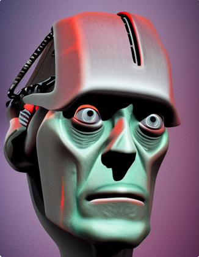
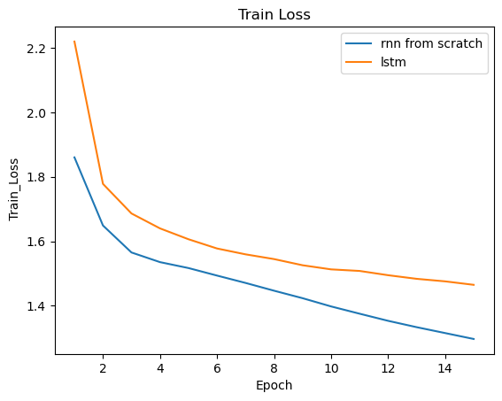
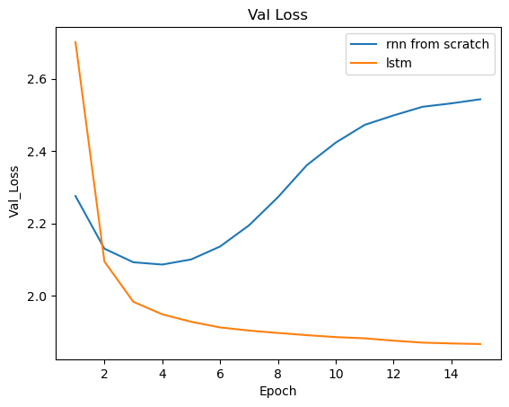

# RNN from Scratch 

A custom implementation of the RNN architecture from scratch with pytorch. The 2 hidden layer RNN was trained on Mary Shelley's novel Frankenstein to predict the next token. The performance of the RNN was compared with an LSTM network.

Although the implemetation seems to work, it's also clear that the custom network gets overfitted very fast, so the default architecture isn't powerful enough to learn any pattern from the text. 
